# Web Visualization Dashboard (Latitude)

## Project Overview
This "Latitude with Attitude"  dashboard uses data from a previous assignment (https://github.com/klharp/Python-API-WeatherPy-VacationPy). Specifically,  [weather data](Resources/cities_data.csv) was used.

Languages and libraries used:

* HTML
* CSS

---

Site can be viewed on Github pages here: https://klharp.github.io/Web-Visualization-Dashboard/

## Website Requirements

For reference, see the ["Screenshots" section](#screenshots) below.

The website must consist of 7 pages total, including:

* A [landing page](#landing-page) that contains:
  * An explanation of the project.
  * Links to each visualizations page. There should be a sidebar containing preview images of each plot, and clicking an image should take the user to that visualization.

* Four [visualization pages](#visualization-pages), each with:
  * A descriptive title and heading tag.
  * The plot/visualization itself for the selected comparison.
  * A paragraph describing the plot and its significance.
  * The ability to navigate between the four pages.
  * Each of these pages are accessible from the dropdown in the navigation menu.

* A ["Comparisons" page](#comparisons-page) that:
  * Contains all of the visualizations on the same page to compare.
  * Used a Bootstrap grid for the visualizations.
  * Linked to the individual visualization pages.
  * Linked to open the graphic in a separate window.
 
* A ["Data" page](#data-page) that displays a responsive table containing the data used in the visualizations.

* An ["About" page](#about-page) that provides information about Kerry Harp

* A [navigation bar](#navigation-menu) that includes site title and navigation elements, including a drop-down menu.

* A [footer](#footer) that provides information page links and contact information

## Screenshots

This section contains screenshots of each page that must be built, at varying screen widths. These are a guide; you can meet the requirements without having the pages look exactly like the below images.

### Landing page

Large screen:

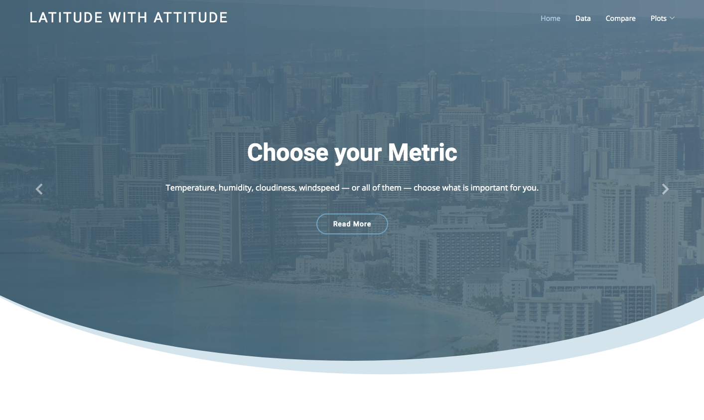

Small screen:

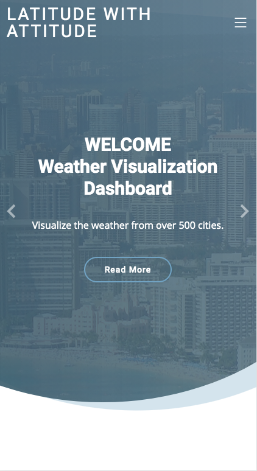


### Comparisons page

Large screen:

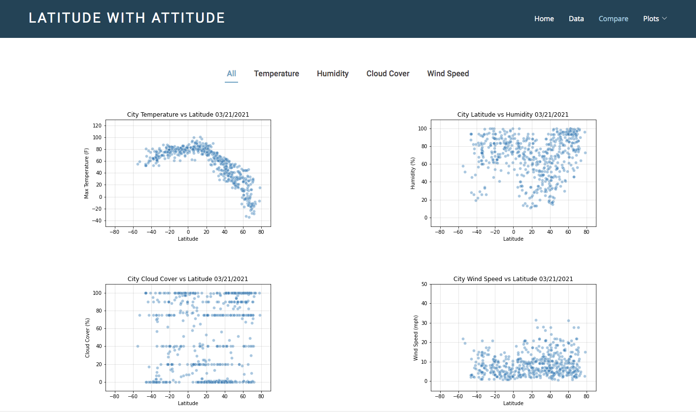

Small screen:

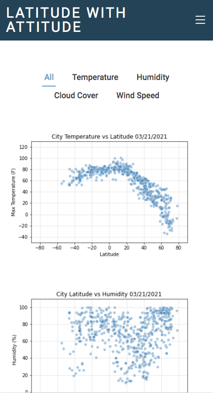

### Data page

Large screen:

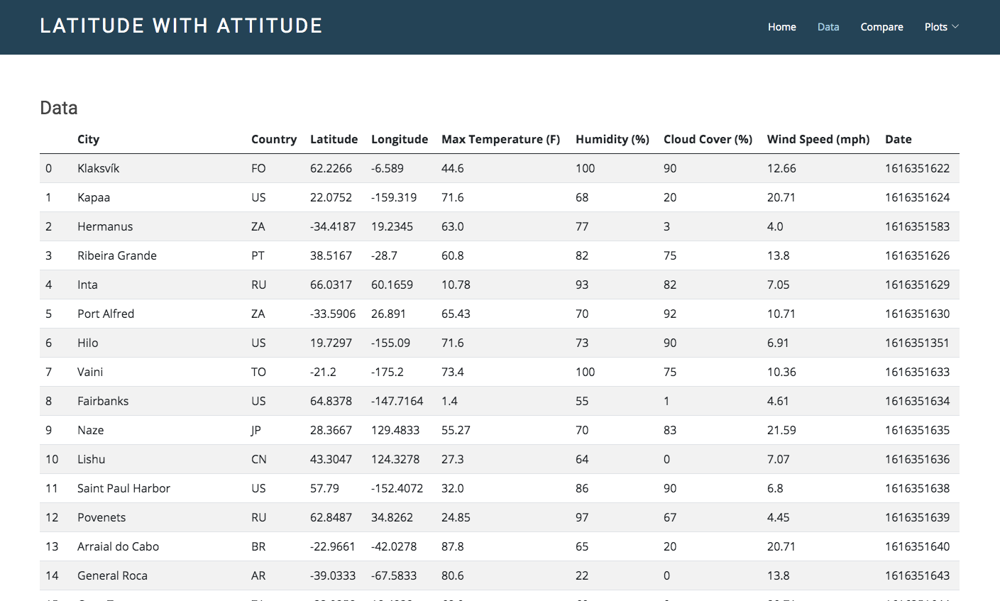

Small screen:

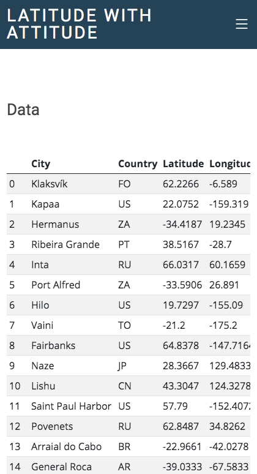

### Visualization pages

You'll build four of these, one for each visualization. Here's an example of one:

Large screen:

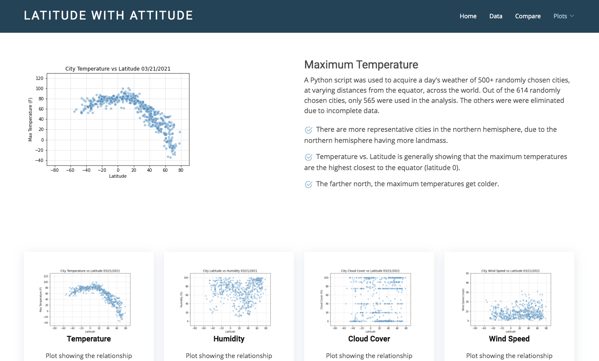

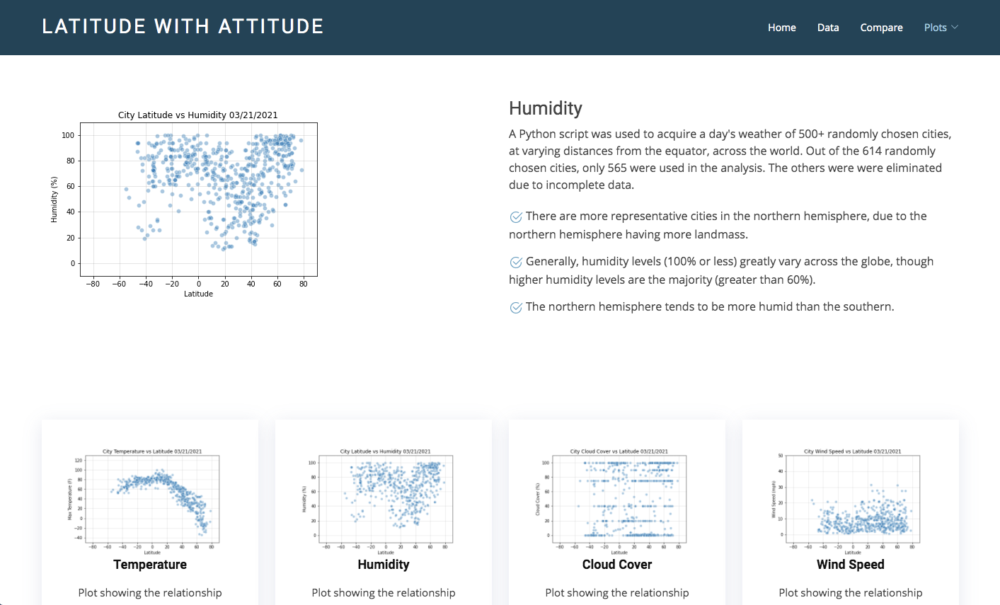

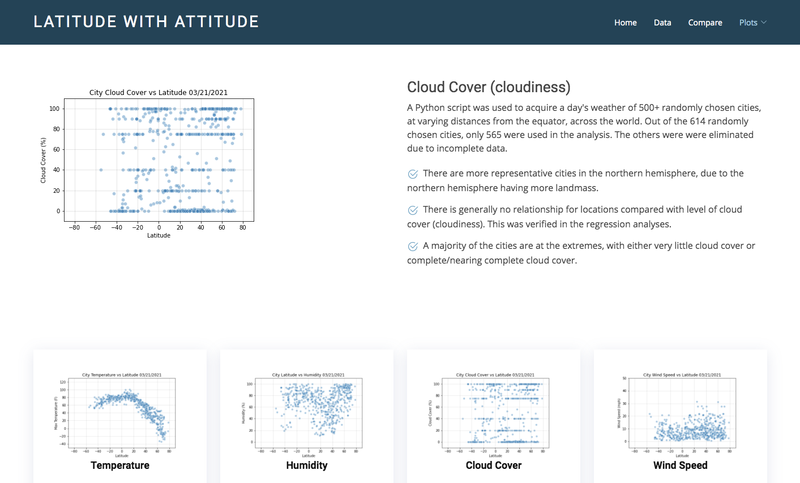

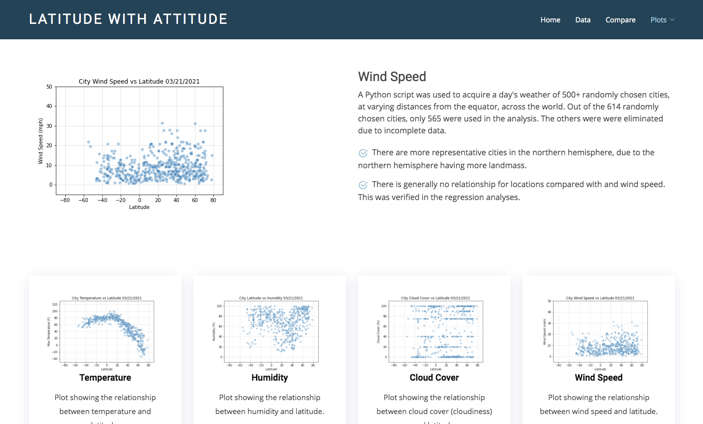

Small screen:

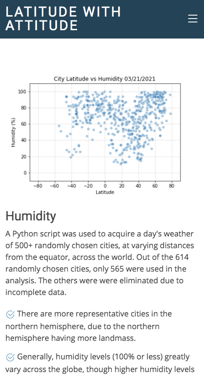

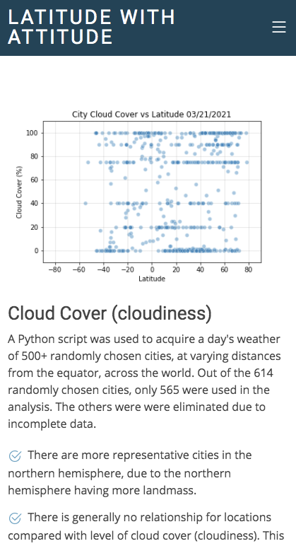

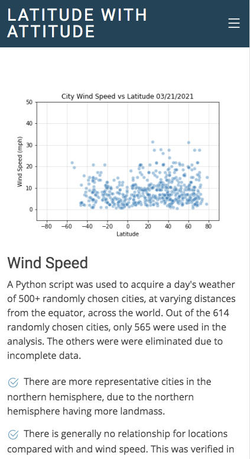

### About page

Large screen:

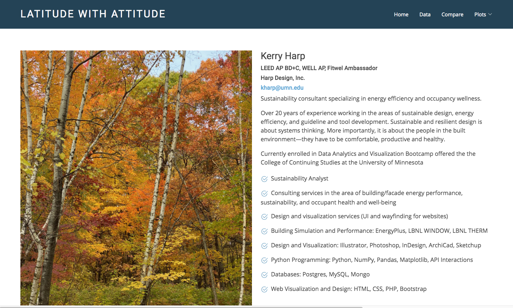

Small screen:

### Navigation Bar

Large screen:
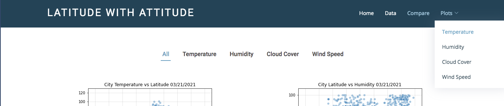

Small screen:
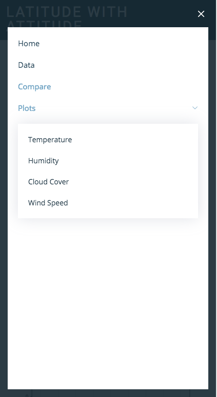

#### Footer

Large screen:
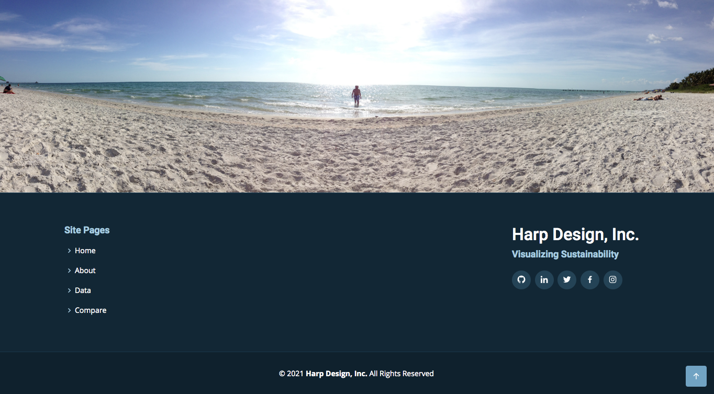

Small screen:
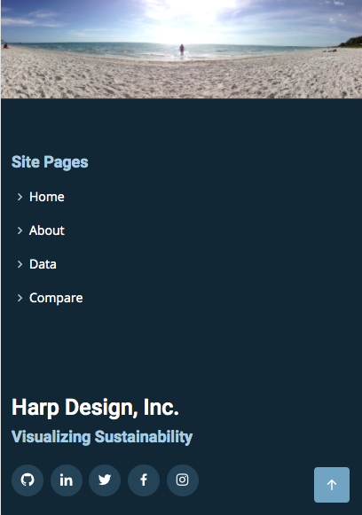

